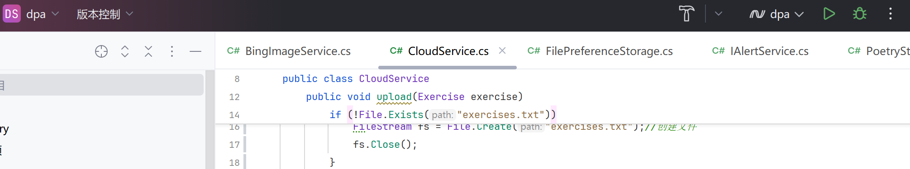
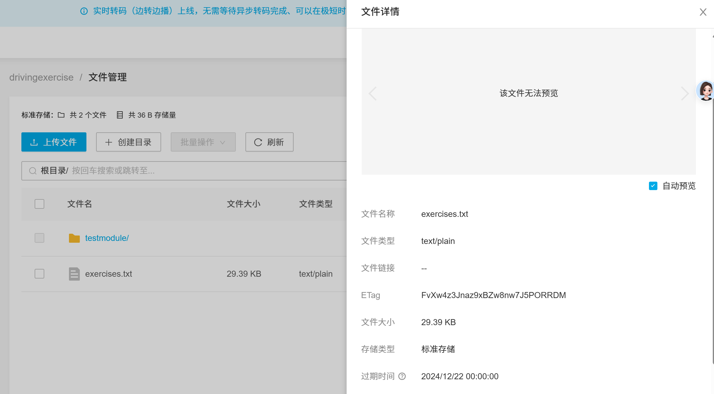
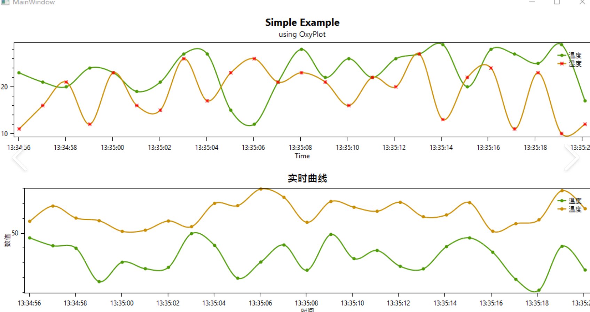

# CSharp_dotNet_Avalonia_智慧驾考系统

#### 介绍
大三上学期、即2024下半学期，使用.net/c#编写的全栈桌面项目，使用了avalonia框架、可以跨端运行，通过依赖注入运行程序。代码量约1万行。 
具体内容包括在线练习，每次获取50道题、每天可获取50次。除此之外，本项目添加了ai问答功能、云端记录错题，以及中国交通新闻网的新闻推送，和错题回顾反省功能，帮助用户综合了解交通知识。此外系统还会自动记录用户每天的答题情况、以数据面板的形式展现出来，并通过数学工具预测用户驾考中能得到的分数，以助用户了解自身学习情况。 
欢迎进一步下载和探索(*^▽^*)
在线答题

新闻推荐

AI问答

错题回顾

错题云存储

进步面板（请注意绘图插件oxyplot并未随avalonia 11更新、暂时无法使用！！！因此已将该部分代码注释，若您有更好的意见、欢迎提出改进方法！！）

#### 软件架构
 

-智慧驾考系统

            -dpa（前端）

                -Views（页面）

                      -MainWindow（主窗体）

                      -MainView（主界面）

                      -AnswerView（在线答题页面）

                      -WrongView（错题回顾页面）

                      -ProgressView（进步面板页面）

                      -...

                -Services
                      -MenuNavigationService（页面跳转服务）

                      -RootNavigationService（初始化跳转服务）

                      -...

                -...

            -dpa.Library（后端）

                -ViewModels（页面模型）

                     -MainWindow（主窗体页面模型）

                     -AnswerView（在线答题页面模型）

                     -WrongView（错题回顾页面模型）

                     -...

                -Services

                     -AdviseService（新闻抓取服务）

                     -AIReplyService（ai问答服务）

                     -CloudService（云存储服务）

                     -PoetryStorage（本地数据库服务）

                     -PredictService（数据预测服务）

                     -...

                -Models

                     -Exercise（练习题）

                     -Record（答题记录）

                     -...

                -Helpers

                     -DBHelper（数据库处理）

                     -ErrorMessageHelper（错误信息处理）

                     -...

                -...

             -...

#### 安装教程
本项目使用RD（Jetbrains Rider）开发，因此给出的是RD教程，请自行斟酌
1.  跟随网上教程安装RD

2.  打开本项目文件夹，等待项目初始化。如果项目缺包，请进入nuget包管理，对照下列包列表补全

3.  如果运行成功，点击右上角调试按钮，直至页面出现即可

#### 使用说明

1.  在线答题

1.1 题目获取 
本项目使用了聚合数据的“驾照题库”api，由于目前处于免费版，一次可获取50道题、一天可获取50次。
在图片的显示上，由于bitmap在图片加载速度上的弊端，本项目做出创新：使用了asyncimageloader包，该包可接收网络图片链接、并直接进行下载和显示，速度要比bitmap快得多 
 
1.2 答题结果 
用户点击答案后，正确选项显示绿色、错误选项显示红色，并且右侧答案栏显示出答案解释 
 
1.3 新闻推荐 
本项目从“中国交通新闻网”（https://www.zgjtb.com/）的头条目录里随机选取文章，利用htmlagilityback插件抓取html内容，并显示在右边栏。 
 
 
 
点击“了解详情”，可从浏览器跳转至对应文章

1.4 ai问答 
本项目采用异步编程，调用讯飞集团的星火大模型api，对用户问题作出回答，提升用户体验。 
点击侧边栏上的ai机器人图标，ai页面覆盖侧边栏 
 
输入您的问题，即可获取ai回答 
 
 
为了增强对话连续性、增强用户体验，本项目给大模型增加了“记忆”功能，用户过去的聊天记录会被作为assistant内容传给ai。 
当然，如果您不想ai保留过去的记忆，可以点击“清除记忆”消除记录 
 
1.5 问题保存 
本项目保存问题一共有两种手段：本地数据库，云端数据库 
① 本地 
点击后调用DBHelper的函数。 
本项目使用copy流、将原有的数据库文件复制到用户电脑上。之后所有数据都会被存储到该数据库文件上，防止了干扰用户文件统一性。 
 
② 云端 
本项目使用了“七牛云”提供的免费存储空间，命名为“drivingexercises”。 
当用户点击“保存错题”后，错题会同时被存储进本地文件“exercise.txt”，然后该文件会被上传至七牛云端。这样即便本地数据库丢失，用户也可以在云端重新获取题目 
（需要使用Qiniu插件包） 
 
 
用户可以下载exercises.txt，打开可以看到过去的错题 
 

2.  错题回顾
 
这里使用了observerable来监控错题。一旦在线答题界面有新的错题加入，导致错题集合发生改变，这个行为就会被错题界面捕捉，从而刷新界面、加入新的错题。 
 
错题会显示在右侧列表，点击列表中错题、切换当前展示的错题 
 

3.  进步面板
（注：由于oxyplot不支持avalonia 11、本项目暂时取消了该部分代码） 
本项目使用record类记录了用户每天作答的对、错题数。提取这些数据后，可以使用oxyplot包，绘制用户的进步曲线 
（如果您想用livechart来绘制对应的图表，欢迎进行补充！） 
 
 
得到用户每日作答对题数后，我们将每日对题数除以作答总数、即可得到用户每日得到的分数。 
接着我们使用数学插件MathNet，使用高次线性逻辑回归、根据过去的分数、对下一次分数进行预测，从而作为用户驾考成绩的参考 
 

#### 目前问题
1.  由于oxyplot未跟上avalonia 11更新、目前无法绘制图表，若您有好的解决办法欢迎分享
2.  目前默认传输的驾考题目为“科目一”、“C1证”，并未进行分类，如果您对此感兴趣欢迎补充功能

#### 参与贡献

1.  Fork 本仓库
2.  新建 Feat_xxx 分支
3.  提交代码
4.  新建 Pull Request

#### 特技

1.  使用 Readme\_XXX.md 来支持不同的语言，例如 Readme\_en.md, Readme\_zh.md
2.  Gitee 官方博客 [blog.gitee.com](https://blog.gitee.com)
3.  你可以 [https://gitee.com/explore](https://gitee.com/explore) 这个地址来了解 Gitee 上的优秀开源项目
4.  [GVP](https://gitee.com/gvp) 全称是 Gitee 最有价值开源项目，是综合评定出的优秀开源项目
5.  Gitee 官方提供的使用手册 [https://gitee.com/help](https://gitee.com/help)
6.  Gitee 封面人物是一档用来展示 Gitee 会员风采的栏目 [https://gitee.com/gitee-stars/](https://gitee.com/gitee-stars/)
